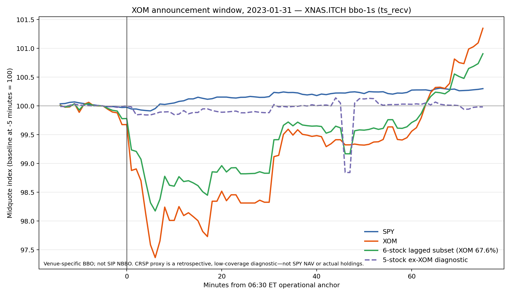

# Observed SPY/XOM paths — 2023-01-31

**Status: `PATHS_AND_PROXY_COMPUTED`.** The figure and endpoints are a descriptive reconstruction of venue-specific BBO midquotes around the operational 06:30 ET XOM-results anchor. They are not an information-share estimate, a causal attribution, or a same-cash-flow comparison.

## Main observations

The primary, predeclared feed is XNAS.ITCH `bbo-1s`, using `ts_recv` (interval-end) time. For the 06:30 ET anchor, each object's baseline is its observed midquote at or before 06:25 ET, indexed to 100.

| Object | +1 min | +5 min | +15 min | +30 min | +60 min |
| --- | ---: | ---: | ---: | ---: | ---: |
| SPY | -5.39 bp | -8.65 bp | +15.05 bp | +16.18 bp | +27.47 bp |
| XOM | -112.14 bp | -241.19 bp | -199.36 bp | -167.32 bp | -44.05 bp |
| 6-stock lagged subset | -76.45 bp | -168.15 bp | -138.49 bp | -116.93 bp | -28.88 bp |
| 5-stock ex-XOM diagnostic | -1.92 bp | -15.64 bp | -11.39 bp | -11.70 bp | +2.80 bp |

The XOM midquote falls materially in this feed (about 2.41% at +5 minutes), while SPY is down about 0.09% at that endpoint and rises later in the hour. The declared clock sensitivity does not alter the broad observation: XOM's +5-minute change is -187.34/-241.19/-257.80 bp at the 06:29/06:30/06:31 ET anchors, versus SPY -8.65/-8.65/-3.26 bp. This is not evidence that the XOM release caused either path: the window may contain unrelated market information and a BBO midpoint is not fundamental value.

## Lagged holdings stock proxy

The proxy is explicitly a **retrospective low-coverage CRSP lagged-report-stock subset**, not SPY's event-time holdings, NAV, PCF, or a tradeable information set. It uses the 2022-12-31 CRSP report (effective date 2023-01-09), sums reported `nbr_shares` by ticker, and normalizes the subset's baseline marked value to 100. The fixed set was selected before inspecting response direction: report stocks with a date-valid XNAS mapping and a valid state by the 06:30 baseline and all declared endpoints.

The resulting set is AIG, BSX, CMI, EA, LHX, and XOM: 6 of 504 ticker-identified stock candidates. Their reported `percent_tna` fields sum to 2.0999996 percentage points, versus 100.3799701 across all 505 Dec-31 report rows (2.092% of that all-row sum). XOM is 67.62% of the subset's baseline marked value, so the all-six path mechanically resembles XOM and must not be interpreted as an ETF basket response. The predeclared fixed five-stock ex-XOM counterpart is therefore shown solely as a spillover diagnostic; its +5-minute change is -15.64 bp. Neither proxy is representative of SPY.

The sharp ex-XOM dip visible at +46/+47 minutes is not a broad five-stock move. It is driven by one sparse XNAS BSX state observed at 07:15:01 ET (bid 41.66, ask 46.61, an approximately 1,122 bp spread) and then carried for 59/119 seconds at the minute marks. ARCX had BSX at 45.73/46.13 at the same timestamp and shows no comparable dip. The XNAS point is a genuine observed venue state under the stated carry-forward rule, but it is a single-name, wide-quote artifact and should not be interpreted as spillover.

## Data quality and limits

All endpoints for SPY and XOM are observed in XNAS.ITCH at all three anchors. The selected 06:30 endpoint quote ages are 0–4 seconds for SPY through +60 minutes, and 0–22 seconds for XOM; XOM spreads are wide immediately after the anchor (about 54–90 bp at 0/+1 minute), so small within-spread movements should not be overread. BATS and ARCX provide separate SPY/XOM venue diagnostics; XNYS has no selected XOM records. No venues were merged and none is SIP NBBO. `QUALITY_SUMMARY.json` preserves mappings, record counts, subset basis, retained symbols, and baseline-value concentration.

The existing DBNs contain only a small mapped constituent slice, and the CRSP report does not establish actual holdings applicable at the event. No EPS surprise was constructed. Thus this result resolves the immediate engineering question—observable ETF and stock paths exist—but does not resolve the broader event-time basket or news-signal requirements.

## Coordinator judgment and one next action

The single-event measurement is operationally usable: the fixed clock, historical identifiers, venue-specific BBO reconstruction and endpoint calculations all work, and the main SPY/XOM directions reproduce on ARCX. The event also contains a large, time-local XOM move followed by substantial reversal, while SPY moves little at +5 minutes. That is enough signal to test whether this pattern repeats, but the low-coverage constituent proxy is too concentrated and stale to answer where the full basket discovers price.

The next action is a **finite six-announcement SPY/issuer-stock replication using the same fixed clock and endpoint code**, retaining every previously selected technical event regardless of its path. Reuse existing files first and buy only exact missing issuer/ETF windows within the available credit. Report event-by-event paths and their common-support summary; do not wait for historical State Street holdings and do not present the exercise as the final basket or causal price-discovery test. Its purpose is to decide quickly whether the observed stock-versus-ETF separation is repeatable enough to justify broader constituent data.
