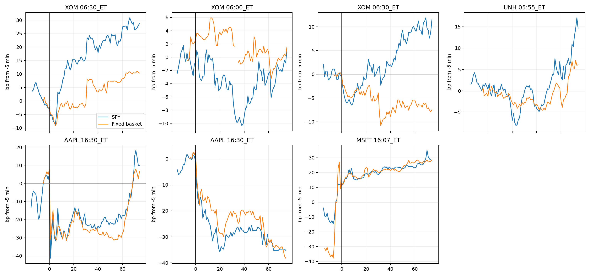
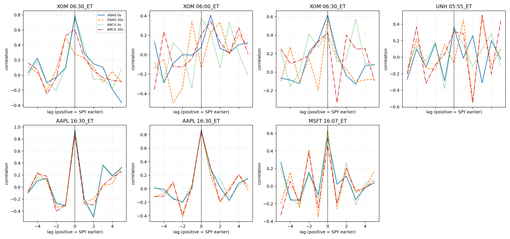
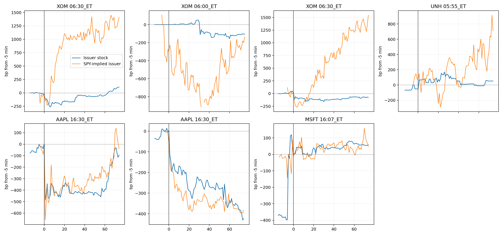

# ETF／股票篮子时序试点结果

**决定：`ADVANCE_BOUNDED_RESEARCH`。** 当前试点不支持“ETF 系统性领先股票”或“股票系统性领先 ETF”。它支持一个更窄、但可复现的结论：两个 AAPL 财报窗口和 MSFT 通知窗口在一分钟尺度上同步调整；盘前 XOM／UNH 窗口的领先方向随场所、30 秒网格或陈旧报价改变。下一步只对既有数据运行一次一秒级反应起点比较，不再购数或扩事件；若仍无法稳定区分，就停止“谁领先”的主叙述。

## 实际样本与覆盖

三个滞后报告期分别有 500–501 个普通股 ticker，普通股权重约 99.55%–99.61%。Databento 对单场所的历史映射覆盖约 97.7%–97.9%。为了让两个场所和 0／30 秒网格使用完全相同的股票集合，主篮子进一步要求每个成分在 baseline 至 +30 分钟均有有效状态；固定覆盖权重因窗口而异：

| 窗口 | 固定覆盖权重 | 一分钟主结果 | XNAS +5 分钟：SPY／篮子／差额（bp） |
| --- | ---: | --- | ---: |
| XOM 2023-01-31 06:30 | 57.61% | 场所／网格敏感；多数设定为 lag 0 | −8.65 / −9.13 / +0.47 |
| XOM 2023-07-28 06:00 | 64.12% | 混合；不支持领先结论 | −3.52 / +3.04 / −6.56 |
| XOM 2023-07-28 06:30 | 71.18% | 混合；三项为 lag 0，一项为 +3 | −5.83 / −4.80 / −1.03 |
| UNH 2023-04-14 05:55 | 56.99% | 0 与 +3 分钟混合 | +1.45 / +0.15 / +1.31 |
| AAPL 2023-02-02 16:30 | 83.83% | 四个设定均为 lag 0 | −31.69 / −30.39 / −1.30 |
| AAPL 2023-08-03 16:30 | 64.47% | 四个设定均为 lag 0 | −16.43 / −11.77 / −4.65 |
| MSFT 2023-04-25 16:07 | 97.78% | 四个设定均为 lag 0 | +18.32 / +18.30 / +0.02 |

MSFT 的 16:07 是“结果已经可用”的通知，不是已验证的最初发布时刻，因此它只证明高覆盖窗口的同步测量可行。两个 AAPL 事件的主窗口 lag-0 相关分别为 0.953 和 0.867；在 XNAS/ARCX 和 0/30 秒网格的四种设定中，最大相关全部位于 lag 0。这个结果可以排除“一分钟或更慢的稳定领先”，不能区分同一分钟内部谁先调整。

## 关键反例和误差诊断

XOM 7 月 28 日 06:00 的 XNAS +5 分钟篮子回报为 +3.0439bp，其中 ICE 单只股票贡献 +3.0791bp。ICE baseline 报价为 75.50/120.00，价差约 4,552bp，且已陈旧 357 秒；+5 分钟状态也已陈旧 544 秒。统一“剔除最大绝对 +5 贡献成分”敏感性把该设定的最佳 lag 从 +1 改成 0，ARCX 没有相同 ICE 现象。因此该窗口不能解释为 ETF 领先。

发行人权重导致 residual 诊断明显放大误差：AAPL／MSFT 的 `1/w` 为 13.0–16.5 倍，XOM／UNH 为 70.9–85.5 倍。图中数百至上千 bp 的 SPY-implied issuer 路径主要反映该放大机制，不是可独立使用的价格发现证据。

## 科学判断

本轮已经给出结果，不再保留泛化 HOLD：

- **没有观察到稳定的 ETF-leading 或 stock-basket-leading 模式。** 四个盘前变体都对 venue、网格或陈旧成分敏感。
- **观察到可重复的一分钟同步。** 两个 AAPL 窗口在全部四个设定中均为 lag 0；MSFT 通知窗口也如此。
- **当前数据支持“高度同步”，尚不支持“谁主导”。** 当前 lag 方法的时间分辨率成为实质限制，而不是更多分钟窗口或更多同类购数可以解决的问题。
- **滞后报告篮子仍是 retrospective proxy。** 它不是事件时真实 PCF；固定共同覆盖从 56.99% 到 97.78%，低覆盖盘前窗口不能承担总体领先判断。

`ADVANCE_BOUNDED_RESEARCH` 的唯一下一行动是：使用已经购买的 bbo-1s 数据，对两个 AAPL 事件和 2023-01-31 XOM 事件运行一次预声明的一秒级反应起点比较，同时保留 XNAS/ARCX、bid/ask 状态和固定篮子。不得新增事件或购数。若三个窗口不能给出跨场所稳定的同一方向，就将“ETF 与股票谁领先”裁定为现有数据无法支持，并停止该主叙述。

本决定不是集中度机制、因果识别、总体功效或论文 GO。它把下一步压缩为一个已有数据即可完成的最终分辨率检验。
