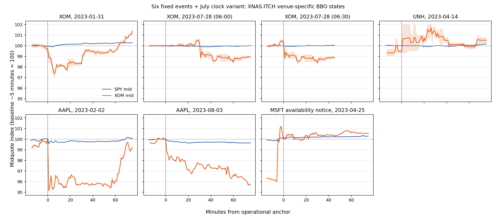

# Six-event observed SPY/issuer paths

**Status: all fixed event/issuer pairs reconstructed.** Eight exact SCC downloads complete common SPY/issuer coverage for all six fixed events; no event was replaced or selected by its return.

The figure has seven panels: six fixed events plus the separately retained second July XOM clock variant. The July 06:30 ET panel ends after +45 minutes because both source DBNs end at 11:15:59 UTC; its +60 endpoint and later path are explicitly unavailable, not carried-forward returns.

At the XNAS.ITCH +5-minute endpoint, the Jan. 31 XOM variant is SPY **-8.65 bp** and XOM **-241.19 bp**. On July 28, retaining both source-supported anchors gives SPY/XOM **-3.52/0.00 bp** at 06:00 ET and **-5.83/-108.19 bp** at 06:30 ET. XOM's July timing ambiguity is therefore material to the measured short-window path.

The target-time state repair made no Jan. 31 XNAS endpoint change relative to the prior valid-row reconstruction: no later invalid BBO state occurred at the tested endpoints. Unlike the old approach, the decoder retains undefined, one-sided, crossed, and conflicting same-timestamp updates through target selection, so an invalid later state cannot be bypassed by an earlier valid quote. Across the selected symbols in all 12 source DBNs, the independent review found only valid raw BBO messages and no conflicting same-timestamp states; consequently the repair did not alter any available reviewed baseline, +5, or +60 value. No separate synthetic-test artifact is claimed.

The plotted feeds are venue-specific BBO, not SIP NBBO. Midpoint changes are accompanied in `ENDPOINTS.csv` by bid/ask, quote age, and cross-spread change bounds. These are not confidence intervals or executable-return bounds.

## Completed coverage

| Fixed event | Existing primary XNAS state | Common-path result |
| --- | --- | --- |
| UNH, 2023-04-14 | exact XNAS/ARCX DBNs | common path computed |
| AAPL, 2023-02-02 | exact XNAS/ARCX DBNs | common path computed |
| AAPL, 2023-08-03 | exact XNAS/ARCX DBNs | common path computed |
| MSFT, 2023-04-25 | exact XNAS/ARCX DBNs | common path computed |

The eight successful downloads have a quoted total of **$0.015461146832**, recorded in the execution receipt as a quote-based download total; an independent billing-ledger debit was not observable. Raw licensed DBNs stayed on SCC.

## Interpretation and next action

At +5 minutes the XNAS issuer paths are XOM -241.19 bp (Jan), XOM 0.00/-108.19 bp (July variants), UNH +75.54 bp, AAPL -471.66/-156.47 bp, and MSFT +45.30 bp; SPY ranges from -31.69 to +18.32 bp. Using the latest qualifying lagged report weights, the issuer-weight products are about 39% of the absolute SPY move for January XOM, 0%/22% for the July clocks, 67% for UNH, 90%/74% for the two AAPL dates, and 15% for the MSFT notice. These ratios are descriptive and unstable when the SPY move is small, but they show that ordinary index dilution can explain much of the SPY magnitude in several windows. They are not event-time contributions or causal residuals. The MSFT 16:07 ET anchor is an availability-notice window, not a verified original-release time. The six fixed events cover four issuers, six dates, and seven clock variants; repeated issuers, the July clock conflict, and the MSFT notice mean they do not support price discovery, information-share, causal, or population inference.

**Next action:** for the same six dates, construct a predeclared lagged-report rest-of-SPY basket and the corresponding ETF-implied issuer component, then compare its path with the issuer stock. This is a bounded same-component measurement pilot: retain every event and clock label, report tracking error, and keep the lagged basket explicitly separate from an event-time holdings claim. It directly tests whether ETF and stock timing can be compared before expanding the event sample or running information-share estimators.
