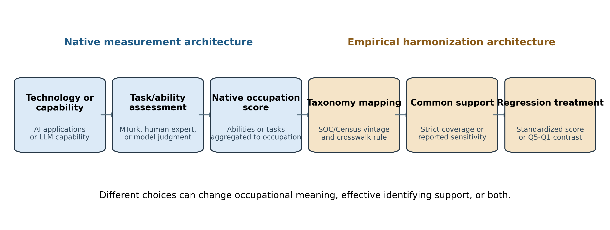
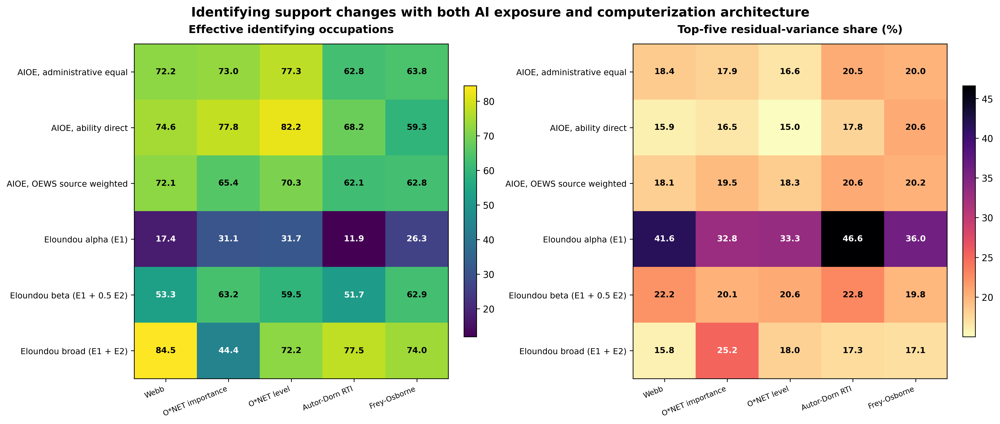
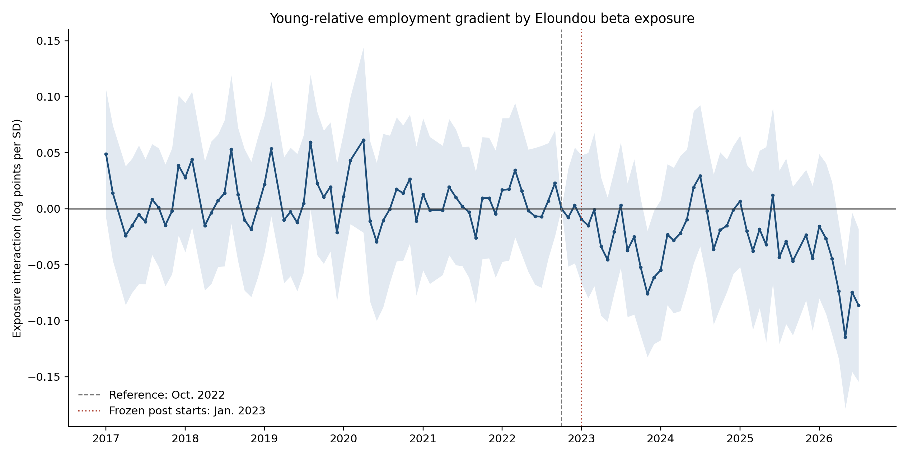

# What Is AI Exposure? Measurement Architecture, Identifying Variation, and Early-Career Employment

Lily Luo
Second manuscript draft — August 2026

## Abstract

Occupational “AI exposure” is widely used as though it were a common treatment, although prominent indices begin from different technologies, occupational primitives, labelers, and aggregation rules. I trace these choices from native score construction through occupational mapping, identifying variation, and labor-market inference. Six measures differ sharply in occupational content. Across 30 pre-specified AI-by-computerization architectures, the effective number of occupations supplying residual treatment variation ranges from 11.9 to 84.5. <!-- prov:A01 --> Harmonization also matters mainly through which occupations enter the estimand, rather than through large score revisions among already matched occupations. Measurement disagreement, however, need not imply outcome fragility. In a common nationally representative CPS design, every pre-specified top-versus-bottom exposure-quintile estimate is negative, ranging from about -9% to -19%; the primary estimate is approximately -12%. <!-- prov:A02 --> The sign survives alternative exposure, support, computerization, and remotability definitions. Magnitudes do not: they vary materially with the construction of both AI exposure and prior computerization, and the direct beta-alpha comparison is too imprecise to establish economic equivalence. The evidence supports sign robustness without magnitude or causal invariance.

## 1. Introduction

The empirical AI-and-labor literature increasingly speaks of occupational “AI exposure” as though it were a common treatment. Researchers merge an exposure score onto occupations, interact it with time, and interpret the resulting coefficient as evidence about artificial intelligence and work. That workflow is now routine. The object entering the regression is not.

Prominent indices begin from different economic primitives. The Felten-Raj-Seamans family starts with applications of artificial intelligence, relates them to occupational abilities, and aggregates through O\*NET ability requirements (Felten, Raj, and Seamans 2018, 2021). The Eloundou-Manning-Mishkin-Rock family starts with large-language-model capabilities, asks whether an LLM—alone or with complementary software—could reduce the time required for occupational tasks, and aggregates task judgments to occupations (Eloundou et al. 2024). The resulting variables may be correlated, but correlation does not make their technologies, occupational content, or identifying comparisons interchangeable.

This paper asks three linked questions:

> **What is the empirical X? What occupational variation identifies X? Which labor-market conclusions survive different definitions of X?**

The empirical laboratory is the recent debate over early-career employment in occupations more exposed to generative AI. This setting is useful because the outcome is important, administrative-data work reports sizable declines for workers aged 22–25 in highly exposed occupations, and public-data evidence has been less uniform. I hold the CPS outcome, age comparison, timing, estimator, support, and inference fixed before accessing post-period outcomes, then vary the architecture of the AI treatment and of the pre-existing technology margin against which it is evaluated.

The paper makes three contributions.

**First, it shows that widely used measures constitute different empirical X's.** Across six AI-exposure measures and eight transparent occupational characteristics, the three AIOE variants load strongly on cognitive content, education, wages, teleworkability, and computer use. Eloundou alpha—the share of tasks directly accelerated by an LLM—has much weaker relationships with most of those characteristics, while beta and the broad E1+E2 measure occupy intermediate positions. In a joint audit, the eight characteristics explain 36.8% of alpha variation and 95.4%–97.1% of the three AIOE variants. <!-- prov:I01 --> These patterns do not prove that no common latent AI factor exists. They show why the classical representation

\[
X_m=X^*+\epsilon_m
\]

should not be assumed without evidence: different measures can encode distinct technologies, occupational primitives, and implementation assumptions rather than classical noise around one transparent treatment.

**Second, it shows that different measurement architectures imply different identifying designs.** Nominal coverage says how many occupations enter a regression; it does not say where residual treatment variation lies. Across 30 pre-specified AI-measure-by-computerization-control pairs, the effective number of identifying occupations ranges from 11.9 to 84.5, and the five largest contributors account for 15.0% to 46.6% of residual variation. <!-- prov:I02 --> Conditional on Webb software-patent exposure, alpha has 17.4 effective occupations and a 41.6% top-five share; beta has 53.3 and 22.2%. <!-- prov:I03 --> The central applied question is therefore:

> **When an applied labor paper estimates an “AI-exposure effect,” which occupational comparisons are actually generating that coefficient?**

Occupational mapping and common support belong to the same problem. In a four-step AIOE decomposition, correcting exposure values on unchanged support barely changes the coefficient, from -0.01885 to -0.01920. Re-admitting occupations changes it to -0.03156; excluding computer and mathematical occupations leaves -0.02940. <!-- prov:I04 --> The main consequence of harmonization operates through who enters the estimand, not through large score revisions among occupations already matched.

**Third, it establishes sign robustness without magnitude invariance.** Across 12 pre-specified alpha/beta headline models, the post-January-2023 Q5–Q1 estimates range from -0.0971 to -0.2085 log points—exactly -9.3% to -18.8% after the transformation \(100(e^\beta-1)\)—and every wild-bootstrap confidence interval excludes zero. <!-- prov:I05 --> The primary beta-by-Webb strict-support estimate is -0.1311 (95% CI [-0.2170, -0.0451]; p = .003), an exact 12.3% relative decline in the young-worker employment stock in Q5 versus Q1. <!-- prov:I06 --> The outcome is an occupation-by-age-group stock, not an individual unemployment probability; it can change through entry, exit, or occupational switching.

This robustness has limits. The beta estimate moves from -0.1001 to -0.2085 as the definition of pre-existing computerization changes. <!-- prov:I07 --> The direct paired beta-minus-alpha difference is -0.0324 (95% CI [-0.1023, 0.0376]; p = .403). <!-- prov:I08 --> The design does not detect a cross-measure difference, but the interval is too wide to establish economic equivalence. Measurement disagreement therefore need not imply outcome fragility, yet a stable sign does not make magnitude or causal interpretation invariant.

The contribution is relevant beyond AI. Applied economics routinely constructs treatments from automation exposure, trade exposure, routine-task content, climate risk, technology indices, and policy-intensity scores. Different constructions of a nominally similar treatment may change not only correlation or coverage, but the weighted comparisons that identify the coefficient. YAX provides one transparent case in which that full chain can be observed.

The paper proceeds as follows. Section 2 presents measurement architecture and the three nearest literatures. Section 3 describes CPS employment stocks and occupational harmonization. Section 4 separates the continuous-score and headline-quintile estimands. Sections 5 and 6 study construct content and effective identifying support. Section 7 asks what survives measurement divergence. Sections 8 and 9 examine comparison technologies, remotability, dynamics, and falsification. Sections 10–12 discuss implications, limitations, and conclusions.

## 2. What Is Occupational AI Exposure?

### 2.1 Measurement architecture

An occupational exposure score compresses a long sequence of choices into one variable. At minimum, the researcher chooses a technology or capability definition, an occupational primitive, a source of labels, an aggregation rule, an occupational taxonomy, a crosswalk, a support rule, and a regression scale. Figure 1 separates native construction from empirical harmonization.

**Figure 1. Measurement genealogy.** Native technology and labeling choices are followed by occupation aggregation, taxonomy mapping, common-support decisions, and construction of the regression treatment. The figure summarizes pre-outcome measurement documentation and introduces no outcome result.

Table 1 summarizes the measures used in the confirmatory analysis. The AIOE family maps ten AI applications to 52 occupational abilities using crowd judgments and then combines ability exposure with occupation-specific O\*NET requirements (Felten, Raj, and Seamans 2018, 2021). The three YAX variants retain the same conceptual family but vary aggregation: an administrative equal-weight construction, a direct ability construction, and a source-employment-weighted construction.

The Eloundou family instead labels occupational tasks according to whether an LLM can reduce task-completion time by at least half while maintaining quality (Eloundou et al. 2024). Alpha counts E1 tasks, for which an LLM alone can achieve the threshold. Beta adds half weight to E2 tasks, for which the threshold becomes feasible with complementary software. The broad E1+E2 score is called zeta in the published paper; the repository preserves the source data's `gamma` field name but labels the object “broad” in the manuscript.

The difference is economic, not merely computational. An ability-based score may emphasize broad cognitive requirements relevant to many AI applications. A task-based LLM score may emphasize current technical feasibility. Adding E2 embeds a view about complementary software and organizational implementation. None is automatically the “correct” treatment for every question.

See [Table 1](tables/table1_anatomy_of_ai_exposure_measures.md).

### 2.2 Three nearest literatures

**Measurement instability.** Yin, Vu, and Persico (2026) hold a task rubric fixed and vary the frontier LLM supplying annotations; exposure scores and downstream coefficients change materially. Yin and Ogut (2026) hold an observed-use design fixed but vary platform-user inputs, showing how platform selection affects measured exposure and employment estimates. Those papers isolate instability within an annotator or input family. I study a complementary margin: cross-family architecture, from abilities versus tasks through taxonomy and support, and then into the occupations that supply identifying variation in a common labor design.

**Construct and comparative-exposure research.** Rai (2026) shows that AIOE and Eloundou scores load on cognitive occupational content, while Webb behaves differently. Frank et al. (2025) compare several scores as predictors of pre-ChatGPT unemployment risk. Eckhardt and Goldschlag (2025) use five measures for CPS unemployment, labor-force exit, and switching, with public code that makes mapping alternatives visible. The Budget Lab (2026a, 2026b) harmonizes seven metrics and applies them to public labor outcomes. Pulito et al. (2026), the closest same-outcome/same-specification predecessor, estimate firm AI adoption with five standardized exposure indices. These studies establish that score comparison, harmonization, and coefficient movement are not new in isolation. The incremental step here is to connect construction and construct content to effective identifying occupations, mapping-induced estimand composition, and direct same-design inference.

**Early-career labor-market evidence.** Brynjolfsson, Chandar, and Chen (2026) document a deterioration in employment stocks for workers aged 22–25 in highly exposed occupations using ADP administrative data; their August revision includes multiple exposure measures, improved mapping, remote-work controls, and CPS/ACS benchmarks. Emanuel, Harrington, and Pallais (2026) show in the CPS that post-pandemic labor-market deterioration for young college graduates is concentrated in remotable occupations and remains after an AI-exposure control. EIG and other public-data work examine related unemployment, exit, and switching outcomes. YAX does not claim to discover the young-worker pattern. It asks which parts of that conclusion remain stable when exposure architectures are made commensurable inside one nationally representative employment-stock design.

The novelty boundary is therefore narrow but affirmative. The paper is not the first comparison of exposure scores or occupational mappings. It is an integrated audit of **what X is, what variation identifies X, and what conclusion survives alternative definitions of X**. Newer capability, retrieval, reinforcement-learning, and market-targeted measures make that sequence increasingly relevant, but an inventory of those indices is not needed for the main argument.

## 3. Data and Occupational Harmonization

### 3.1 CPS employment stocks

The labor-market analysis uses monthly IPUMS Current Population Survey microdata from January 2017 through July 2026. The wide extract contains 9,262,480 person records. Employed respondents are aggregated with CPS weights into occupation-by-age-group-by-month employment stocks. The young group is ages 22–25; the comparison group pools ages 26–65. The resulting unit is a cell, not a person.

This choice avoids assigning an occupation to someone who is not employed. It also defines the interpretation sharply. A decline in the young employment stock of an occupation can reflect fewer entrants, exits from employment, or movement to another occupation while remaining employed. The design cannot separate these channels and does not estimate an individual probability of unemployment.

The static post period begins in January 2023 and ends in July 2026. December 2022 is retained as a transition month in the event study but excluded from the static post coefficient because ChatGPT was released on November 30, after the November CPS reference week. October 2025 is absent from the source series and is excluded.

### 3.2 Occupational taxonomies

The CPS occupation system changes during the sample. Raw 2017–2019 codes use the Census 2010 occupation taxonomy, while 2020 onward uses Census 2018. The harmonization maps pre-2020 occupations to Census 2018 using the Census Bureau's official total conversion rates. Post-2020 codes are matched directly. Native SOC-based exposure measures are first collapsed within six-digit SOC codes and then mapped to Census occupations using official crosswalks and available employment weights. Missing components are never silently renormalized under the primary rule.

The strict primary coverage rule retains an occupation only when every mapped component has an exposure score. It covers 88.70% of eligible employment. Two pre-specified sensitivities report sibling imputation and scored-component renormalization when at least 95% of component mass is observed. These rules are not interchangeable: they define different populations and therefore different estimands.

The analysis distinguishes nominal code coverage from employment coverage and both from effective identifying support. A dataset can contain hundreds of occupations while a regression coefficient is effectively driven by a few dozen. Section 6 makes that distinction operational.

### 3.3 Mapping decomposition

The four-step decomposition in Table 4 asks whether harmonization matters by changing exposure values among already matched occupations or by changing which occupations enter the analysis. It begins with the original AIOE values on original support, replaces values while holding support fixed, expands support using the repaired mapping, and finally excludes computer and mathematical occupations from the expanded sample. Because the coefficient is reported per fixed SD of AIOE and always conditions on Webb exposure, the sequence isolates measurement correction from composition as transparently as the available mapping permits.

## 4. Empirical Framework

The analysis uses two related but distinct saturated Poisson pseudo-maximum-likelihood specifications. Separating them matters because the headline Q5–Q1 coefficient is not the continuous-score coefficient reported in the mapping and remote-work exercises.

### 4.1 Continuous-score specification

For per-standard-deviation analyses, the model is

\[
E[N_{oat}] = \exp\left[\gamma_{oa}+\delta_{ot}+\lambda_{at}
+\beta_X(X^z_o\times Young_a\times Post_t)
+\beta_C(C^z_o\times Young_a\times Post_t)
+\beta_R(R^z_o\times Young_a\times Post_t)\right],
\]

where \(X^z_o\) is the employment-weighted standardized AI-exposure score, \(C^z_o\) is standardized computerization, and \(R^z_o\) is standardized occupation-level remotability when that control is included. Terms not used in a particular pre-specified model are omitted. \(\beta_X\) is the post-period change in the young-relative employment-stock gradient per one weighted standard deviation of exposure. The four-row mapping decomposition fixes the AIOE standardization reference so that coefficient movement does not mechanically reflect a changing SD. The remote-work models also use the continuous scale.

### 4.2 Headline quintile specification

The main literature-comparable estimates replace the continuous AI interaction with four exposure-quintile indicators:

\[
E[N_{oat}] = \exp\left[\gamma_{oa}+\delta_{ot}+\lambda_{at}
+\sum_{q=2}^{5}\beta_q\left(\mathbf{1}\{Q_o=q\}\times Young_a\times Post_t\right)
+\beta_C(C^z_o\times Young_a\times Post_t)\right].
\]

Quintiles are formed from the native AI-exposure score using pre-period employment weights on each model's estimation support. Q1 is omitted. Q2, Q3, and Q4 enter separately rather than being pooled. The headline parameter is therefore \(\beta_5\): the post-period change in the young-relative employment stock for Q5 compared with Q1, conditional on the standardized computerization interaction and the fixed effects. The primary estimate \(-0.131\) is \(\hat\beta_5\); it is not the continuous-score coefficient \(-0.038\) reported in the remotability analysis.

### 4.3 Fixed effects, inference, and interpretation

In both equations, \(N_{oat}\) is the weighted employment stock in occupation \(o\), age group \(a\), and month \(t\). Occupation-by-age-group fixed effects absorb each occupation's persistent young-versus-older gap. Occupation-by-month fixed effects absorb shocks to an occupation that affect both age groups. Age-group-by-month fixed effects absorb the national young-versus-older path. Every lower-order interaction is absorbed by one of those fixed-effect families. What remains is a change in the within-occupation young-versus-older gap across occupations with different pre-defined exposure, conditional on the same age-relative post interaction for the comparison technology.

The primary exposure is Eloundou beta. Alpha is the pre-specified contrast. Webb software-patent exposure is the primary computerization control; O\*NET computer-use importance, O\*NET computer-use level, Autor-Dorn routine-task intensity, and Frey-Osborne automation probability are pre-specified alternatives. Standardized-score models support the remote-work and mapping exercises.

Inference clusters by occupation. The primary confidence intervals and p-values use at least 999 occupation-cluster Rademacher wild-bootstrap draws. The paired beta-alpha comparison applies the same draw to both estimators and constructs the difference within draw, preserving covariance. The design and interpretation rules were frozen before protected post-period outcomes were opened; the repository tag is a git-verifiable design freeze, not an external preregistration.

Three families of tests organize the evidence. Test A asks whether exposure measures encode different occupational content. Test B asks which residual occupational comparisons identify each score conditional on a chosen computerization margin. Test C holds outcome, support, estimator, and inference fixed and asks whether alternative exposure definitions yield distinguishable downstream coefficients.

## 5. Do AI-Exposure Measures Capture the Same Occupational Construct?

Table 2 reports all 48 pre-specified employment-weighted correlations: six AI-exposure measures by eight occupational characteristics. The characteristics are cognitive ability importance, manual and physical ability importance, Autor-Dorn routine-task intensity, required education, log mean annual wage, Dingel-Neiman teleworkability, STEM employment share, and O\*NET computer-use importance.

The AIOE variants form a recognizable cluster. Their correlations with cognitive content range from 0.653 to 0.689; with education, 0.688 to 0.708; with log wages, 0.611 to 0.640; with teleworkability, 0.741 to 0.754; and with computer use, 0.847 to 0.854. Their correlations with manual and physical content are between -0.913 and -0.939. This is coherent with an ability-based measure that emphasizes cognitively intensive work, but it also means AIOE is empirically close to familiar dimensions of skilled, computer-mediated work.

Eloundou alpha behaves differently. Its correlations are -0.032 with cognitive content, -0.034 with education, 0.011 with wages, 0.200 with teleworkability, 0.436 with STEM share, and 0.304 with computer use. Beta becomes more similar to the AIOE pattern once software-complemented tasks enter: 0.478 with cognitive content, 0.425 with education, 0.478 with wages, 0.589 with teleworkability, and 0.797 with computer use. The broad E1+E2 measure moves further in that direction. These differences are consistent with the economics of the scoring rules: E2 introduces tasks whose acceleration depends on complementary software, which overlaps naturally with the digital organization of work.

Routine-task intensity is not the axis on which the measures diverge most. Correlations with RTI are positive but modest, from 0.108 to 0.217. Nor do the results imply that AIOE is merely teleworkability or computer use. The point is that the measures weight those dimensions differently and therefore encode different occupational content.

The joint residual audit sharpens the comparison. On common support of 348 occupations, the eight characteristics explain 95%–97% of the three AIOE variants, 74% of beta, 81% of the broad Eloundou measure, and only 37% of alpha. Alpha's residual is not diffuse: 31.5 effective occupations remain, and the top five account for 33.7% of residual variance. The corresponding effective counts are 35.5–44.2 for AIOE and 36.9 for beta. A score can therefore be distinct from observable characteristics and still rely on a concentrated residual.

See [Table 2A](tables/table2a_construct_diagnostics.md) and [Table 2B](tables/table2b_joint_construct_residual_audit.md).

The evidence supports “construct divergence” in a disciplined sense. It does not establish six unrelated treatments, and it does not recover a uniquely correct latent index. It establishes that construction architecture has observable empirical content and that researchers should not invoke a common latent treatment without showing what is shared and what is measure-specific.

## 6. Where Does the Identifying Variation Come From?

Test B residualizes each AI-exposure measure on each of five computerization controls using pre-period employment weights. For each of the 30 combinations, it reports the residual variance, the inverse-Herfindahl effective number of identifying occupations, the share carried by the five largest contributors, the dominant occupational family, and the names of the leading occupations.

### 6.1 Effective identifying occupations

Let \(X_o\) denote an AI-exposure score, \(C_o\) the relevant computerization measure, and \(w_o\) the occupation's total January 2017–November 2022 employment stock across the two age groups. The diagnostic first estimates the weighted projection

\[
X_o=a+bC_o+\widetilde X_o.
\]

Occupation \(o\)'s share of residual treatment variation is exactly

\[
s_o=\frac{w_o\widetilde X_o^2}{\sum_j w_j\widetilde X_j^2}.
\]

The effective occupation count is the inverse Herfindahl of these shares:

\[
N_{\mathrm{eff}}=\frac{1}{\sum_o s_o^2}.
\]

An effective count of 17 does not mean that only 17 occupations enter the regression. It means that the concentration of weighted residual treatment variation is equivalent to 17 equally influential occupations under this diagnostic. \(N_{\mathrm{eff}}\) is not conventional regression leverage, an influence-function estimate of \(\hat\beta\), or an outcome-based diagnostic. It is computed before post-period outcomes are read and describes where the treatment variation available to identify a conditional exposure gradient lies.

### 6.2 Results across 30 architectures

**Figure 2. Identifying support across all 30 pre-specified architectures.** The left panel reports the effective number of identifying occupations; the right panel reports the residual-variance share carried by the five largest occupations. Values reproduce the pre-outcome diagnostic in `TEST_B_IDENTIFYING_VARIATION_FULL.csv`. Across cells, effective occupations range from 11.9 to 84.5 and top-five shares from 15.0% to 46.6%. <!-- prov:F02 -->

The key distinction is between nominal support and effective support. Eloundou alpha and beta both have 468 occupations when conditioned on Webb. Yet alpha has only 17.4 effective occupations and a 41.6% top-five share, while beta has 53.3 effective occupations and a 22.2% top-five share. Software developers alone carry 19.6% of alpha's residual variance in that architecture. The remaining leading contributors are computer programmers, bookkeeping clerks, billing clerks, and administrative assistants. Beta's top contributors are software developers, construction laborers, maids, bookkeeping clerks, and hand freight laborers.

Changing the computerization control changes the comparison. Conditional on O\*NET computer-use importance, alpha has 31.1 effective occupations; its leading contributors remain concentrated in programming and clerical work. Beta has 63.2 effective occupations and is led by retail supervisors, automotive technicians, bookkeeping clerks, wholesale sales representatives, and truck drivers. Conditional on Autor-Dorn RTI, alpha falls to 11.9 effective occupations and a 46.6% top-five share. The broad Eloundou score, by contrast, reaches 84.5 effective occupations under Webb and 77.5 under RTI.

The three AIOE variants are generally more diffuse than alpha across computerization controls, with effective counts mostly between 59 and 82. They are not identical. The ability-direct variant under O\*NET level reaches 82.2 effective occupations, while the OEWS-weighted variant under RTI has 62.1. The identities of the top occupations also rotate across architectures.

See [Table 3A](tables/table3_identifying_variation_all_30_architectures.md).

These diagnostics reveal what comparison the design is asking the outcome data to price. Two models can use almost the same number of occupation codes yet estimate substantively different weighted contrasts.

This result also changes how collinearity should be discussed. A high raw correlation does not automatically make a coefficient unidentified; it raises variance and changes the residual comparison. Conversely, low raw correlation does not guarantee broad support. Alpha conditional on Webb has low correlation but highly concentrated residual variance. Effective identifying support is therefore a more informative complement to the usual variance-inflation factor.

### 6.3 Why can construct divergence coexist with sign robustness?

The pre-outcome rank-overlap audit gives a mixed answer. Within the AIOE family, extreme rankings are highly similar: Q5 Jaccard overlap ranges from 0.793 to 0.886. <!-- prov:B01 --> Within the Eloundou family, beta and alpha share moderate Q5 overlap (0.539) and their weighted residuals correlate 0.716; beta and the broad score share 0.585 of Q5 and have residual correlation 0.880. <!-- prov:B02 --> Shared tails can therefore help explain directional stability within a construction family.

Cross-family overlap is much weaker. The Q5 overlap between the three AIOE variants and alpha is only 0.216–0.237; for AIOE and beta it is 0.414–0.465. <!-- prov:B03 --> The common negative sign is thus not merely the same set of occupations receiving different numerical labels. Some extreme occupations overlap, especially for beta, but cross-family constructs and residual comparisons remain distinct. Sign robustness is consequently more informative than a within-family robustness check, while still falling short of a common structural effect.

See [Table 3B](tables/table3b_extreme_rank_and_residual_overlap.md).

## 7. What Survives Measurement Divergence?

### 7.1 Headline estimates

Table 5A reports all 12 pre-specified headline models: alpha and beta, two computerization controls, and three support rules. There is no outcome-based selection. Every Q5–Q1 coefficient is negative and every wild-bootstrap 95% confidence interval excludes zero. The estimates range from -0.0971 to -0.2085 log points, equivalent to -9.3% to -18.8% under \(100(e^\beta-1)\).

The primary strict-support beta-by-Webb estimate is -0.1311 (bootstrap SE 0.0444, 95% CI [-0.2170, -0.0451], p = .003) across 468 occupations. It means that, after the pre-specified January-2023 start, the young-versus-older employment stock evolved 12.3% less favorably in the most exposed quintile than in the least exposed quintile, conditional on Webb software-patent exposure and the saturated fixed effects. It does not mean that a young individual became 12.3% more likely to be unemployed.

Support rules matter less than computerization definitions in these headline models. Under Webb, beta estimates are -0.1311, -0.1186, and -0.1186 across Rules A, B, and C. Under O\*NET computer-use importance they are -0.2085, -0.1744, and -0.1746. Alpha estimates cluster between -0.0971 and -0.1087 across all six support-control combinations. Sign robustness is therefore unusually strong relative to the heterogeneity documented in Sections 5 and 6.

See [Table 5A](tables/table5a_frozen_headline_models.md).

### 7.2 All six exposure constructions

Table 5B places all six exposure constructions into the same strict-support/Webb design. The three AIOE Q5–Q1 coefficients are -0.1032, -0.1176, and -0.0977. Alpha is -0.0987, beta is -0.1311, and the broad Eloundou score is -0.1570. Every interval excludes zero. The pattern is not monotonic across all construction families, but within the Eloundou family a broader definition produces a more negative point estimate.

This is evidence of downstream sign robustness, not proof that exposure measurement is irrelevant. First, the point estimates differ by economically meaningful amounts. Second, Sections 5 and 6 show that the measures have different occupational content and identifying support. Third, the inferential question is the coefficient difference, not whether one coefficient is significant and another is not.

### 7.3 Paired beta-alpha inference

The direct paired comparison uses common Rule-A/Webb support and common wild-bootstrap draws. Beta is -0.13107, alpha is -0.09868, and beta minus alpha is -0.03240. The paired standard error is 0.03697; the 95% percentile-t interval is [-0.10235, 0.03755], with p = .403. The interval includes zero. Under the pre-outcome interpretation rule, the design does not detect a difference.

That sentence cannot be inverted into equivalence. The original plan required an economically meaningful equivalence bound derived from a literature-comparable benchmark. The benchmark audit found no published estimate matching the YAX age groups, employment-stock outcome, Q5–Q1 contrast, young-relative-to-pooled-older estimand, and scale. Rather than invent a threshold, the design retired equivalence inference. The ex-ante paired precision diagnostic—80% power to detect about 3.27 percentage points—remains useful, but the realized confidence interval still contains large positive and negative differences.

See [Table 5B](tables/table5b_same_design_different_x.md).

### 7.4 Relation to recent administrative-data estimates

Brynjolfsson, Chandar, and Chen (2026) report early-career employment declines of a similar order in ADP administrative data. YAX is not an exact replication. Their prominent 19% statistic compares the two most exposed quintiles with the bottom three for workers aged 22–25; their -0.179 Q5 coefficient is a within-young occupation-level long difference. YAX uses CPS rather than ADP, Q5 versus Q1 rather than the headline top-two/bottom-three contrast, pooled ages 26–65 as the comparison group, a saturated monthly employment-stock estimator, and an independently harmonized occupational mapping. The defensible claim is **independent nationally representative evidence of a similar-order early-career employment pattern under a different outcome construction and empirical design**. The 19% statistic is neither an exact benchmark nor a calibration target.

## 8. Computerization and Remote Work

### 8.1 Defining AI exposure net of prior computerization

The empirical object “AI exposure net of prior computerization” is not defined until the comparison technology is itself defined. The question “AI rather than computerization?” therefore cannot be answered by adding an unexamined generic control. Webb software-patent exposure, O\*NET computer-use importance, O\*NET computer-use level, Autor-Dorn routine-task intensity, and Frey-Osborne automation probability are not interchangeable measures of one obvious conditioning variable. They represent patent-task overlap, the importance and level of computer interaction, routine-task composition, and broad automation susceptibility. Each leaves a different residual occupational comparison.

Panel A of Table 6 reports the downstream consequence. Under strict support, the beta Q5–Q1 estimate is -0.1311 with Webb, -0.2085 with O\*NET computer-use importance, -0.1512 with O\*NET level, -0.1277 with RTI, and -0.1001 with Frey-Osborne. All remain negative and their intervals exclude zero, but the magnitude varies by more than a factor of two.

This is not merely specification instability, and it does not select one estimate as the true AI effect. The estimand is jointly defined by the AI treatment and the prior-technology margin partialled out of it. The more-than-twofold point-estimate range is therefore a substantive limitation: a single causal-sounding AI coefficient is not invariant to the comparison technology. A reader asking whether an estimate is “really computerization” must ask which computerization construct is intended, what occupational comparison remains, and whether its effective identifying support matches the proposed mechanism.

### 8.2 Occupation-level remotability

Remote work is a core competing interpretation because Emanuel, Harrington, and Pallais (2026) document a national CPS deterioration for young college graduates concentrated in remotable occupations and robust to a generative-AI exposure control. Their outcome, sample, and period differ from YAX, but their evidence rules out treating remotability as a cosmetic robustness row.

The pre-specified per-SD beta coefficient is -0.03814 in an AI-only model and -0.03795 after adding occupation-level remotability. In the full AI-plus-Webb-plus-remotability model it is -0.03718. The remote coefficient is 0.00469 in the joint AI-remote model and 0.00606 in the full model; both intervals include zero. Alpha moves from -0.02795 to -0.02376 after adding remotability and to -0.02410 in the full model, with wider intervals that include zero. The remote-only estimate is -0.01884 (95% CI [-0.04508, 0.00739], p = .154).

The appropriate conclusion is narrow: occupation-level remotability does not mechanically absorb the beta exposure gradient in this design. The exercise neither shows that “AI beats remote work” nor that remote work has no effect. Dingel-Neiman remotability is occupational feasibility, not realized individual telework, and the remote coefficient changes sign across alpha and beta architectures. Emanuel-Harrington-Pallais study individual unemployment among college graduates under different ages, timing, treatment, and comparison groups; their result and YAX's stock gradient are not competing estimates of the same parameter.

See [Table 6](tables/table6_computerization_and_remotability.md).

## 9. Dynamics and Falsification

Figure 3 reports the pre-specified monthly event study for the primary beta/Webb strict-support architecture. October 2022 is the reference month, December 2022 is the transition month, and the static post period begins in January 2023.

**Figure 3. Young-relative employment gradient by Eloundou beta exposure.** Points are monthly exposure-by-young interactions per weighted SD, relative to October 2022; shading is the pre-specified 95% confidence interval. None of 65 non-reference pre-event intervals excludes zero. Six of 43 event/post intervals exclude zero: November–December 2023 and April–July 2026. <!-- prov:F03 --> Source: canonical confirmatory `figure1_event_study.png`.

The pre-specified 2017–2019 placebo is 0.00142 (95% CI [-0.02040, 0.02324], p = .894). None of 65 non-reference pre-event monthly intervals excludes zero. We find no evidence of differential pre-trends under the pre-specified event-study specification; this does not prove parallel trends. The confirmatory archive contains pointwise intervals and the placebo but no joint pre-trend test, so none is added after outcomes.

The post path is neither an immediate step nor a smooth monotone decline. Six of 43 event/reference-era coefficients exclude zero, concentrated in November–December 2023 and April–July 2026. The later-window beta coefficient is more negative than the 2023–2024 coefficient: -0.04755 versus -0.03032 per SD. The pre-specified joint difference is -0.01722 with p = .127, so the analysis does not detect a statistically distinguishable post-2025 acceleration.

These timing checks strengthen the descriptive design but do not establish a causal AI shock. A post-2022 break can coexist with technology-sector adjustment, interest-rate changes, return-to-office mandates, post-pandemic normalization, or evolving CPS composition. The saturated fixed effects and age-relative comparison absorb broad versions of those shocks, not every occupation-by-age-specific alternative.

## 10. Implications for the AI-Labor Literature

The first implication is that an exposure coefficient should be reported as an architecture, not merely a variable name. At minimum, researchers should identify the native construct, annotator or evidence source, aggregation rule, taxonomy mapping, support restriction, comparison technology, and regression scale. A statement such as “we control for AI exposure” hides too many consequential choices.

Second, common support is necessary but not sufficient. A fixed sample prevents coefficient differences from being driven mechanically by different missing-data patterns. It does not ensure that the same occupations identify each coefficient. Effective-occupation counts, residual concentration, and named contributors should accompany cross-measure comparisons, particularly when the mechanism invokes a specific occupational family.

Third, harmonization can change the target population even when it barely changes scores among matched occupations. The AIOE decomposition shows that the largest consequence arises from re-admitting occupations. This finding cautions against describing a crosswalk as a neutral clerical step. It also cautions against accusing prior work of a naive exact-code merge without auditing what that work actually did. The latest BCC revision, EIG code, and Budget Lab harmonization all use explicit repairs; YAX studies alternative defensible mappings rather than attributing a known error to those papers.

Fourth, downstream robustness can coexist with measurement divergence. That combination is the empirical surprise of this paper. Six measures correlate differently with occupational characteristics and draw on different identifying occupations, yet every pre-specified same-design Q5–Q1 estimate is negative. This is stronger than a result from one favored index and weaker than proof of a common structural treatment effect. It suggests that the negative early-career stock pattern is not an artifact of one exposure architecture, while leaving its exact magnitude and causal mechanism unsettled.

Finally, comparison technologies deserve the same discipline as treatments. “Computerization” may refer to software-patent task overlap, computer-use intensity, routine-task content, or broad automation susceptibility. The more than twofold range in beta point estimates across those controls is not a reason to choose the estimate one prefers. It is evidence that the conditioning margin is part of the empirical object.

The logic extends beyond AI exposure. Automation, trade, routine-task, climate-risk, and policy-intensity measures are also constructed treatments. For any such index, apparently similar variables can imply different support, residual comparisons, and substantive parameters. The practical standard should therefore extend beyond reporting pairwise correlations: document the architecture, map it transparently, identify the observations supplying residual treatment variation, and test which conclusions survive defensible constructions. This paper establishes that workflow in one setting; it does not claim that the same degree of robustness will hold elsewhere.

## 11. Limitations

The study has six central limitations.

First, the outcome is an occupational employment stock. It is not an individual employment probability. Reduced entry, exit from employment, and occupational switching can all generate the same cell-stock decline. Without separate flow outcomes, the paper cannot label the result layoffs or displacement.

Second, occupational exposure is not realized individual adoption. The scores describe potential exposure or capability-task alignment. They do not observe whether a worker, firm, or occupation uses AI, how intensively it is used, or whether it complements or substitutes for labor.

Third, the DDD is observational. The event study shows no detected differential pre-trends, and the saturated fixed effects absorb rich lower-order shocks. They do not rule out an unobserved occupation-by-age shock correlated with exposure after 2022. Remote-work and computerization exercises constrain simple alternatives but do not establish causal attribution.

Fourth, construct diagnostics depend on the transparent characteristics selected. The eight-characteristic matrix is broad and pre-specified, but it is not an exhaustive ontology of work. A high joint R-squared does not make a score invalid; a low one does not make a score uniquely AI-specific.

Fifth, the paired consequence comparison is imprecise. The beta-alpha interval includes zero and economically large differences. The design detects no difference but offers no formal economic-equivalence conclusion. Only one direct paired contrast was pre-specified.

Sixth, exposure and computerization measures inherit their own taxonomy, vintage, and labeling errors. The harmonization is explicit and reproducible, but it cannot recover information absent from the source measures. Effective-support diagnostics describe where the available variation lies; they cannot create missing independent variation.

These limitations define the contribution. The paper is not a definitive causal estimate of generative AI's employment effect. It is an audit of how exposure measurement becomes identifying variation and how much of one salient labor-market conclusion survives that architecture.

## 12. Conclusion

Constructed treatments should be audited not only for correlation and nominal coverage, but for their architecture, effective identifying support, mapping, conditioning margins, and downstream robustness. Those steps answer different questions. Architecture determines what the index encodes. Effective support shows which comparisons remain after conditioning. Mapping determines who enters the estimand. Same-design inference reveals whether an economic conclusion depends on those choices.

In this setting, AI-exposure architectures differ substantially. Their occupational content diverges, their residual variation is supplied by very different numbers and types of occupations, and harmonization matters chiefly through sample composition. <!-- prov:C01 --> The definition of prior computerization further changes the residual comparison and more than doubles the range of beta point estimates. <!-- prov:C02 --> Yet the negative early-career employment-stock sign survives every pre-specified exposure architecture, with headline magnitudes of roughly 9%–19%. <!-- prov:C03 --> Measurement disagreement therefore need not imply outcome fragility.

That robustness has a precise boundary. The paired beta-alpha comparison is too imprecise to establish economic equivalence; occupation-level exposure is not realized adoption; and an observational employment-stock gradient does not identify individual unemployment, displacement, or a unique AI mechanism. <!-- prov:C04 --> In this application, the sign survives. Its exact magnitude and causal interpretation do not become invariant simply because its sign does.

## References

Brynjolfsson, Erik, Bharat Chandar, and Ruyu Chen. 2026. “Canaries in the Coal Mine? Six Facts about the Recent Employment Effects of Artificial Intelligence.” Stanford Digital Economy Lab Working Paper, revised August 12.

Budget Lab at Yale. 2026a. “Labor Market AI Exposure: What Do We Know?” February 19.

Budget Lab at Yale. 2026b. “What We Do and Don’t Know About How AI Is Affecting the Labor Market.” May 7.

del Rio-Chanona, R. Maria, Ekkehard Ernst, Rossana Merola, Daniel Samaan, and Ole Teutloff. 2025. “AI and Jobs: A Review of Theory, Estimates, and Evidence.” arXiv:2509.15265.

Eckhardt, Sarah, and Nathan Goldschlag. 2025. *AI and Jobs: The Final Word (Until the Next One).* Economic Innovation Group.

Eloundou, Tyna, Sam Manning, Pamela Mishkin, and Daniel Rock. 2024. “GPTs Are GPTs: Labor Market Impact Potential of LLMs.” *Science* 384(6702): 1306–1308. https://doi.org/10.1126/science.adj0998.

Emanuel, Natalia, Emma Harrington, and Amanda Pallais. 2026. “The Power of Proximity to Coworkers.” *Quarterly Journal of Economics* 141(3): 1825–1870. https://doi.org/10.1093/qje/qjag027.

Felten, Edward W., Manav Raj, and Robert Seamans. 2018. “A Method to Link Advances in Artificial Intelligence to Occupational Abilities.” *AEA Papers and Proceedings* 108: 54–57. https://doi.org/10.1257/pandp.20181021.

Felten, Edward, Manav Raj, and Robert Seamans. 2021. “Occupational, Industry, and Geographic Exposure to Artificial Intelligence: A Novel Dataset and Its Potential Uses.” *Strategic Management Journal* 42(12): 2195–2217. https://doi.org/10.1002/smj.3286.

Fenoaltea, Enrico Maria, et al. 2026. “Follow the Money: A Startup-Based Measure of AI Exposure Across Occupations, Industries, and Regions.” *PNAS Nexus* 5(6): pgag185. https://doi.org/10.1093/pnasnexus/pgag185.

Frank, Morgan R., et al. 2025. “AI Exposure Predicts Unemployment Risk: A New Approach to Technology-Driven Job Loss.” *PNAS Nexus* 4(4): pgaf107. https://doi.org/10.1093/pnasnexus/pgaf107.

Lund, Campbell, Thomas Euyang, Zanele Munyikwa, and Marzieh Fadaee. 2026. “AI Exposure Scores: What They Measure, What They Miss, and What Comes Next.” arXiv:2606.23633.

Merola, Rossana, Ekkehard Ernst, Daniel Samaan, R. Maria del Rio-Chanona, and Ole Teutloff. 2026. “Workers’ Exposure to AI: What Indicators Tell Us—and What They Don’t.” ILO Research Brief. https://doi.org/10.54394/00033279.

Mouchel, Luca, Pierre Bouquet, and Yossi Sheffi. 2026. “Jobs’ AI Exposure Should Be Measured from Evidence, Not Model Priors.” arXiv:2605.15474.

OECD. 2026. *The OECD AI Exposure Measure: Mapping the OECD AI Capability Indicators to Occupations.* OECD Artificial Intelligence Papers No. 59. https://doi.org/10.1787/f3da0f0a-en.

Pulito, Giuseppe, Mariola Pytlikova, Sarah Schroeder, and Magnus Lodefalk. 2026. “Who Adopts AI? Evidence on Firms, Technologies and Workers.” Örebro University School of Business Working Paper 3/2026.

Rai, Sudhanshu. 2026. “Do AI Occupational-Exposure Scores Measure AI? AIOE and Eloundou (2024) Largely Capture Cognitive Content; Webb (2020) Does Not.” MPRA Paper 129904.

Tomei, Philip Moreira, and Bouke Klein Teeselink. 2026. “What Jobs Can AI Learn? Measuring Exposure by Reinforcement Learning.” arXiv:2605.02598.

Yin, Michelle, and Burhan Ogut. 2026. “Who Uses AI? Platform Selection and the Measurement of Occupational AI Exposure.” arXiv:2605.21743.

Yin, Michelle, Hoa Vu, and Claudia Persico. 2026. “How (un)Stable Are LLM Occupational Exposure Scores? Evidence from Multi-Model Replication.” NBER Working Paper 35110. https://doi.org/10.3386/w35110.

## Appendix Roadmap

The submission appendix should be assembled from existing confirmatory artifacts only.

- **Appendix A: Exposure construction and lineage.** Native data sources, AIOE aggregation variants, Eloundou notation, and all source hashes.
- **Appendix B: Occupational harmonization.** Census 2010-to-2018 bridge, SOC-to-Census mapping, Rules A–C, excluded occupations, and employment coverage.
- **Appendix C: Complete Test A diagnostics.** Pearson and Spearman matrices, raw rankings, rank overlap, residual correlations, and named residual contributors.
- **Appendix D: Complete Test B diagnostics.** All 30 architectures, residual distributions, occupational-family shares, named contributors, and pairwise overlap in Q1/Q5 and residual rankings.
- **Appendix E: Confirmatory outcome tables.** All 12 headline models, all six alternative exposure constructions, all five computerization controls, the paired Test-C distribution and interval, and the full remote-work table.
- **Appendix F: Dynamics.** All 109 event-study months, the 2017–2019 placebo, the normalized reference month, and the post-2025 joint test.
- **Appendix G: Audit and reproducibility.** Design-freeze differences, first-outcome-access receipt, post-outcome implementation-change ledger, 195-row result ledger, artifact hashes, completion matrix, integrity checks, and clean-checkout reproduction.
