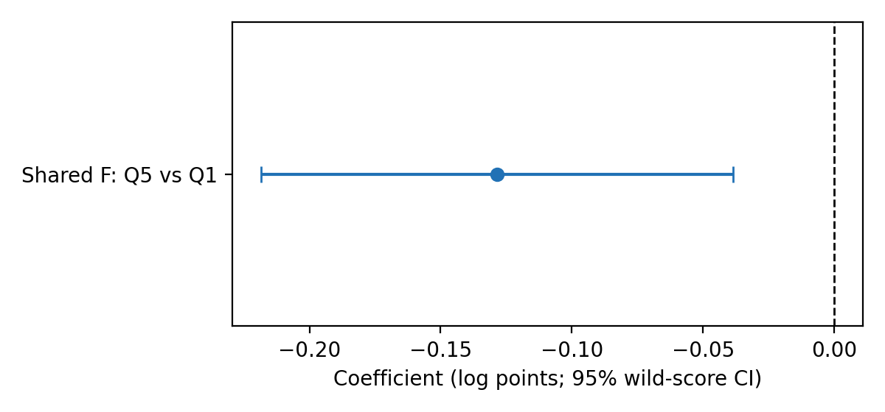
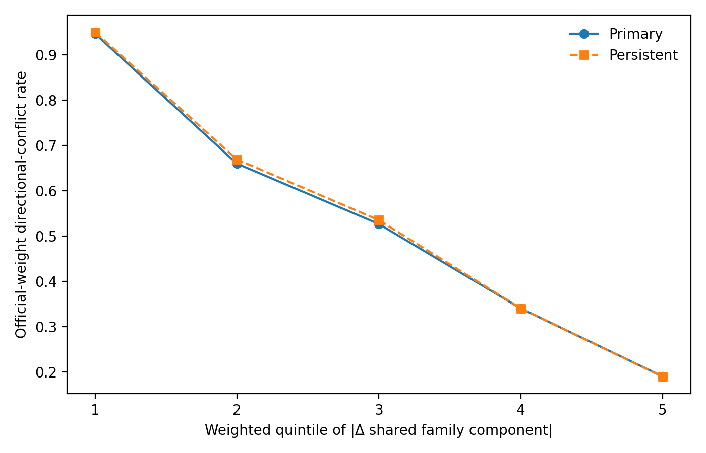

# What Is AI Exposure? Measurement Architecture and Statement-Specific Robustness in Early-Career Employment

Lily Luo  
Fifth manuscript draft — September 2026

> Phase 3 additions are **POST-OUTCOME EXPLORATORY — NOT PART OF CONFIRMATORY YAX v1.1**. Confirmatory and post-outcome analyses are identified separately throughout.

## Abstract

Occupational “AI exposure” is not a common empirical object. Prominent indices begin from different technologies, occupational primitives, labels, and aggregation rules. I trace those choices through occupational mapping, estimator support, employment stocks, and realized occupational movements. Six frozen measures differ sharply in observable occupational content and in the occupations supplying residual treatment variation. Yet all six produce negative point estimates for a Q5-versus-Q1 young-relative employment-stock contrast on literal common support. A transparent shared family component also reproduces that direction: its coefficient is -0.129 log points, or -12.1%, with a 95% wild-score interval of [-0.218, -0.039]. This convergence is statement-specific. Among realized occupational switches on six-way support, 53.3% receive conflicting directional labels across measures, and conflict falls from 94.6% to 19.1% across quintiles of absolute movement in the shared component. A harder rematching benchmark, however, reduces the realized excess conflict from 8.02 to 0.96 percentage points, below a predeclared meaningful-gap threshold. Moreover, simultaneous familywise inference does not support the statement that all six stock coefficients are negative at once. The evidence therefore supports a bounded conclusion: a shared statistical exposure dimension recovers the aggregate employment-stock direction, while architecture choices govern many marginal reallocation labels; robustness does not transfer automatically across economic statements. The estimates are observational and do not identify causal AI effects, displacement, or worker responses to AI adoption.

## 1. Introduction

The empirical AI-and-labor literature often treats occupational “AI exposure” as a common treatment. Researchers merge a score onto occupations, interact it with time, and interpret the resulting coefficient as evidence about artificial intelligence and work. The object entering the regression is less uniform than that workflow suggests.

The Felten-Raj-Seamans family begins with applications of artificial intelligence, links them to occupational abilities, and aggregates through O\*NET ability requirements. The Eloundou-Manning-Mishkin-Rock family begins with large-language-model capabilities, labels tasks by whether an LLM alone or with complementary software could reduce completion time, and aggregates those judgments to occupations. Even within a family, alternative aggregation choices change rankings and support. Correlation among the resulting indices does not make their technologies, occupational content, or identifying comparisons interchangeable.

This paper asks:

> **What empirical object does each exposure architecture construct, where does its identifying information come from, and which labor-market statements survive changing that architecture?**

The application is early-career employment. I hold the CPS outcome, age comparison, timing, estimator, and inference framework fixed while varying the architecture of the AI treatment and the pre-existing technology margin against which it is evaluated. The outcome is an occupation-by-age employment stock. It is not an individual employment probability and cannot by itself distinguish occupational entry, employment exit, or switching.

Three results organize the paper.

First, upstream measurement divergence is substantial. Across eight transparent occupational characteristics, the AIOE variants load strongly on cognitive content, education, wages, teleworkability, and computer use. Eloundou alpha has weaker observable-content relationships; beta and the broader E1+E2 score are intermediate. Continuous residual-treatment support ranges from 11.9 to 84.5 effective occupations across 30 architectures. A supplementary outcome-dependent calculation further shows that residual-treatment support and the exact conditional-information support of the headline estimator are distinct objects. Occupational harmonization matters primarily through the occupations admitted to the estimand, not large score revisions among already matched occupations.

Second, the aggregate stock direction is robust but neither magnitude nor joint inference is invariant. Across 12 confirmatory alpha/beta headline models, January-2023-to-July-2026 Q5-versus-Q1 estimates range from -0.097 to -0.209 log points. The primary beta-by-Webb estimate is -0.131, implying a 12.3% less favorable evolution of the young employment stock relative to the older stock in Q5 than in Q1. On literal common support, all six frozen architecture-specific point estimates are negative. A post-outcome shared family component constructed without outcome-guided rotations produces -0.129 log points. But one simultaneous one-sided upper bound remains positive, so the predeclared familywise statement that all six coefficients are negative simultaneously is not supported. Definitions of prior computerization also move the beta point estimate by more than a factor of two.

Third, robustness is statement-specific. Alternative architectures disagree on the direction of 53.3% of realized occupation switches scored on six-way support. This disagreement survives pair-specific support and is sharply concentrated in movements that are small along the shared family component. Yet a harder benchmark preserving broad origin-destination occupational assortativity has a mean conflict rate of 52.3%, only 0.96 percentage points below realized conflict. The stronger claim that actual pairing is meaningfully unusually conflict-heavy therefore does not survive.

The contribution is not a new causal estimate of AI. It is a disciplined account of when measurement robustness carries from a constructed treatment to an economic statement—and when it does not. A shared component can reproduce an aggregate stock direction without making architecture-specific rankings interchangeable for marginal worker movements. Negative point estimates across measures do not imply a common causal parameter, economic equivalence, or a familywise-sign conclusion.

**Robustness does not transfer automatically across economic statements.**

The remainder of the paper describes the measurement architectures and harmonization, the employment-stock design, upstream content and support, downstream stock results, realized reallocation evidence, computerization and timing checks, and the limits of inference.

## 2. Exposure architectures and occupational harmonization

### 2.1 Six frozen exposure measures

The six measures comprise three AIOE-family constructions and three Eloundou-family constructions. The AIOE variants differ in how AI applications are linked and aggregated through occupational abilities. The Eloundou variants are alpha, beta, and the broad E1+E2 score: direct LLM acceleration, a narrower inclusion of software complementarity, and the broad task-share definition. These are six empirical treatments, not six replications of one observed variable.

All scores are harmonized to the CPS occupation taxonomy through audited SOC crosswalks. Mapping choices are consequential because source measures are largely SOC 2010 objects while the outcome data use post-2018 classifications. A naive exact-code merge covers only 3.33% of computer and mathematical employment; the repaired mapping covers 97.7%. The four-step decomposition shows why this matters. Correcting exposure values while holding original support fixed changes the coefficient only from -0.01885 to -0.01920. Expanding support changes it to -0.03156. Excluding computer and mathematical occupations leaves -0.02940. The main harmonization consequence is therefore compositional: it changes who enters the estimand.

The primary confirmatory analyses use the pre-specified strict support for each architecture. A supplementary literal-common-support sample fixes the same 444 occupations across all six measures. This supports transparent cross-measure comparisons but covers only 83.14% of relevant employment and must not be interpreted as the full labor market.

### 2.2 Shared and architecture-specific components

Phase 3 introduces one transparent descriptive decomposition. It is **post-outcome exploratory and not part of confirmatory YAX v1.1**. Each frozen measure is standardized using the frozen employment weighting. Let A be the equal-weight centroid of the three AIOE measures and E the equal-weight centroid of the three Eloundou measures. Define

\[
F_o=(A_o+E_o)/2, \qquad G_o=(A_o-E_o)/2.
\]

F is the shared family component; G is the family-disagreement component. Each family receives equal total weight. The sign of F is fixed mechanically so that larger values mean greater mean exposure. There is no outcome-guided rotation or factor-number search. F is a shared statistical dimension, not true, latent causal, or correct AI exposure. Architecture-specific displacements are summarized separately when studying switches.

## 3. CPS outcome and empirical design

### 3.1 Employment stocks

The main outcome is the survey-weighted employment stock in occupation-by-age-by-month cells. The young group is ages 22–25; the older comparison group is ages 26–65. The static post period runs from January 2023 through July 2026, with December 2022 treated as a transition month. The wide panel begins in 2017, permitting a long pre-period and explicit pretrend assessment.

The headline treatment uses employment-weighted exposure quintiles. Q1 is omitted and Q2–Q5 enter separately. The reported coefficient is Q5 relative to Q1 for the young group in the post period. Each measure defines its own weighted quintiles; literal common support fixes occupations, not scores, rankings, or treatment membership.

### 3.2 Estimator and interpretation

The occupation-by-age employment stock is estimated by PPML with occupation-by-age, occupation-by-month, and age-by-month fixed effects. The primary model includes the pre-specified Webb software-exposure interaction as the comparison-technology margin. Inference clusters by occupation and uses the frozen one-step wild-score procedure.

The headline coefficient is an era-average conditional stock contrast. It compares how the young employment stock evolved relative to the older stock in high- versus low-exposure occupations. It is not an individual unemployment probability, a layoff probability, or a causal effect of AI adoption. Exposure is potential task alignment, not observed firm or worker use.

## 4. Upstream divergence: content and support

The measures encode different occupational content. On four variables less mechanically linked to AIOE construction—routine-task intensity, wages, teleworkability, and STEM share—the AIOE variants have joint R-squared values of 0.64–0.67. The corresponding values are 0.27 for alpha, 0.43 for beta, and 0.48 for the broad Eloundou measure. These patterns do not prove that no common dimension exists; they reject treating differences as obviously classical measurement error around a transparent treatment.

Nominal coverage is not identifying support. The pre-outcome continuous diagnostic residualizes standardized AI exposure on a continuous computerization measure and decomposes weighted residual variation by occupation. Across 30 AI-by-computerization architectures, the effective number of occupations ranges from 11.9 to 84.5; the five largest contributors account for 15.0% to 46.6% of residual variation.

A supplementary estimator-specific decomposition asks a different question: which occupations supply conditional information for the categorical Q5-versus-Q1 coefficient? It absorbs the fitted PPML design and decomposes the Q5 column's conditional curvature after partialling the other slope columns. Continuous and headline occupation-share ranks correlate around 0.71–0.74 for the four Rule-A alpha/beta-by-Webb/O\*NET architectures, but concentration and leading occupations differ. Under Webb, alpha has 17.4 effective occupations in residual-treatment support and 56.1 in headline conditional-information support, with only one common occupation among the two top-five lists. Neither diagnostic is a finite-sample influence measure.

## 5. Employment-stock results

### 5.1 Confirmatory architecture-specific estimates

Across the 12 pre-specified alpha/beta headline models, all Q5-versus-Q1 estimates are negative and range from -0.0971 to -0.2085 log points. The primary beta-by-Webb strict-support coefficient is -0.1311 (occupation-cluster SE 0.0444; one-step wild-score 95% CI [-0.2170, -0.0451]; p = .003). The transformation \(100(e^\beta-1)\) gives -12.3%.

On literal common support, all six architecture-specific point estimates are negative: -0.0739, -0.1029, -0.1021, -0.1013, -0.1290, and -0.1465 log points for the three AIOE and three Eloundou constructions. This is a point-estimate pattern across six different parameters, not six estimates of one common causal effect.

The paired beta-minus-alpha contrast is -0.0324 log points with a 95% interval of [-0.1023, 0.0376]. The design does not detect a difference, but it cannot establish economic equivalence. Before outcomes, the paired design had 80% power to detect a difference of about 0.0327 log points.

### 5.2 Shared-component stock model

The only new Phase 3 labor-outcome regression is **post-outcome exploratory and not part of confirmatory YAX v1.1**. On the frozen 444-occupation literal support, the shared-F Q5-versus-Q1 coefficient is -0.12854 (cluster SE 0.04698; wild-score p = .005; 95% CI [-0.21849, -0.03858]). The transformed contrast is -12.06%. Q1 contains 117 occupations and Q5 contains 95; the sample represents 83.14% of employment.

**Figure 1. Shared-family-component Q5-versus-Q1 employment-stock coefficient.** Point and one-step wild-score 95% interval. Post-outcome exploratory; not part of confirmatory YAX v1.1.

This SC-A result supports a limited bridge: a broad dimension shared across the two exposure families is sufficient to reproduce the aggregate stock direction. It does not establish that F is the correct exposure score or that it causes the stock change.

### 5.3 Joint sign inference

Phase 3 also applies common occupation-cluster multipliers to the vector of the six existing literal-support coefficients. The null is that at least one architecture-specific coefficient is nonnegative; the alternative is that all six are negative. The procedure preserves cross-architecture covariance but does not impose a common parameter.

Five simultaneous one-sided 95% upper bounds lie below zero. The administrative-equal AIOE bound is +0.01858. Under the frozen familywise criterion, the all-six-negative statement is therefore not supported. The intersection-union marginal p-value is .045, but it does not replace the stricter predeclared simultaneous-bound decision. The defensible statement is that all six point estimates are negative and five have negative simultaneous upper bounds—not that simultaneous negativity has been established for all six.

## 6. Realized occupational reallocation

### 6.1 What survives broader support

The CPS linking exercise identifies 186,370 harmonized adjacent occupational switches; 108,500, or 58.2%, have finite scores at both origin and destination under all six architectures. On that literal intersection, 53.28% of official-weighted transitions receive at least one positive and one negative directional classification, while 45.56% receive the same nonzero direction from all six. Pairwise agreement ranges from 56.52% to 96.58%.

This common-support selection is material. Pair-specific support, however, retains 59.54%–90.80% of weighted switches, and moving from six-way to pair-specific support changes agreement by at most 1.95 percentage points across the 15 frozen pairs. The low-agreement pairs remain low. The robust established claim is therefore descriptive: among realized switches on the stated support, exposure architectures frequently disagree about whether a move raises or lowers measured exposure.

The predeclared young-by-post comparison is null. Conflict is 49.59% for young workers before January 2023, 50.79% after, 53.23% for older workers before, and 54.44% after. The difference-in-differences is essentially zero, with a 95% interval of [-2.67, 2.66] percentage points. Architecture disagreement is relevant to classifying realized reallocation generally, not uniquely more prevalent for young workers in the post period.

### 6.2 Shared versus architecture-specific movement

The Phase 3 decomposition is **post-outcome exploratory and not part of confirmatory YAX v1.1**. For each realized switch, it constructs changes in F, G, and all six standardized architectures. With weighted quintile cuts fixed before viewing the diagnostic, conflict declines from 94.59% in the smallest-|delta F| quintile to 19.06% in the largest. The difference is 75.53 percentage points. The persistent-switch analogue is 75.93 points. The median architecture-specific displacement summary is 1.40 times larger among conflict than unanimous switches.

**Figure 2. Six-architecture directional conflict by weighted quintile of absolute shared-family-component movement.** Primary and persistent switches. Post-outcome exploratory; not part of confirmatory YAX v1.1.

This SC-R1 pattern supplies an empirical organization rather than a causal mechanism. Architectures agree most often when a move is large along their shared dimension and disagree most often when shared movement is small relative to architecture-specific movement. It does not show why workers move or that G has an economic causal effect.

### 6.3 Hard assortative benchmark

The earlier matched-marginal benchmark independently rematched detailed origins and destinations within age-by-month cells. Its mean conflict rate was 45.27%, 8.02 percentage points below the realized 53.28%. Phase 3 imposes a harder constraint: rematching occurs within age group, month, origin broad family, and destination broad family while preserving observed weighted detailed origin and destination marginals.

Across 999 draws, the hard benchmark mean is 52.32% with a reference interval of [52.21%, 52.43%]. The realized-minus-benchmark gap is 0.96 percentage points, below the predeclared 1.00-point meaningful-gap threshold. The persistent-switch gap is 0.88 points. Both are HB-C. Although the descriptive upper-tail area is .001, that precision reflects the computational reference distribution and does not make the remaining gap economically meaningful, conventionally statistically significant, or causal.

Broad origin-destination assortativity therefore accounts for most of the former 8.02-point excess. The paper withdraws the stronger statement that actual pairings are meaningfully unusually conflict-heavy. The frequent disagreement and pair-specific-support results remain; the benchmark-based economic-relevance claim does not.

## 7. Computerization, remotability, and dynamics

“Computerization” is not one conditioning variable. Webb software exposure, O\*NET computer-use importance and level, routine-task intensity, and Frey-Osborne automation susceptibility leave different occupational comparisons. Under strict support, the beta coefficient is -0.1311 with Webb, -0.2085 with O\*NET importance, -0.1512 with O\*NET level, -0.1277 with RTI, and -0.1001 with Frey-Osborne. All are negative, but the magnitude varies by more than a factor of two. Webb is primary because it was fixed before outcomes, not because its estimate was selected.

Occupation-level remotability does not mechanically absorb the beta gradient. The per-standard-deviation beta coefficient moves from -0.03814 in the AI-only model to -0.03795 with remotability and -0.03718 with both Webb and remotability. The beta-by-remotability heterogeneity coefficient is 0.0070 with a 95% interval of [-0.0247, 0.0388]. These exercises do not show that AI “beats” remote work: Dingel-Neiman measures occupational feasibility, not realized telework, and the interval does not establish homogeneous effects.

The categorical monthly event study aligned to the headline Q5-versus-Q1 model finds no detected differential pretrend. A joint test of 65 non-reference pre-event coefficients gives a maximum absolute t-statistic of 1.502 and a wild-score p-value of .929; none of the simultaneous bands excludes zero. The post path is negative in 40 of 42 observed months but is neither immediate nor monotone. The static coefficient is an era average, not evidence of a sharp January 2023 causal break. Technology-sector adjustment, interest rates, return-to-office policies, post-pandemic normalization, and occupation-by-age shocks remain possible alternatives.

## 8. Flow-mechanism boundary

The post-outcome CPS flow exercise does not identify a mechanism behind the stock gradient. Official-longitudinal-weight beta Q5-versus-Q1 coefficients are 0.1195 for employment exit, 0.0107 for occupational outflow, and -0.0888 for entry destination. Their respective 95% intervals—[-0.0668, 0.3059], [-0.1063, 0.1277], and [-0.2787, 0.1011]—all include zero. The mechanism classification is unresolved. No six-architecture flow treatment grid was run.

These nulls matter for interpretation. An aggregate stock contrast can arise through entry, exit, switching, or mixtures of all three. The data do not license labeling the headline result layoffs, displacement, reduced hiring, or worker flight from AI exposure.

## 9. Implications and limitations

The first implication is that exposure should be reported as an architecture, not merely a variable name. Technology definition, occupational primitive, annotator or evidence source, aggregation, taxonomy mapping, support, comparison technology, and regression scale all help define the estimand.

Second, robustness must be attached to a statement. The aggregate stock direction survives six point estimates and is reproduced by a shared family component, but simultaneous familywise negativity is not established. Realized switch labels disagree frequently and that disagreement is organized by shared-component distance, but the claim of an economically meaningful excess over assortative rematching fails. A result robust for one economic statement cannot be exported to another.

Third, common support is necessary but insufficient. It prevents coefficient differences from being driven mechanically by different missing-data patterns, but it does not hold treatment membership fixed or show which occupations carry residual variation or conditional information. Pair-specific support is also essential when evaluating reallocation disagreement.

The study has central limits. Occupational exposure is not realized adoption. The DDD is observational. The stock outcome is not an individual transition. The crosswalk cannot recover information absent from source measures. Phase 3 is post-outcome exploratory. The full CPS survey design cannot be propagated because the public extract lacks the necessary strata, PSU, and replicate-weight information. The headline quintiles also inherit a frozen temporal-weighting ambiguity, although a pre-period-weight sensitivity produces nearly identical membership and magnitude.

Most importantly, the evidence does not identify a unique AI mechanism. A negative high-versus-low exposure stock gradient can coexist with other occupation-by-age shocks. The paper's contribution is measurement and inference discipline, not causal attribution.

## 10. Conclusion

AI-exposure architectures share a broad statistical component, but they remain different empirical treatments. The measures diverge in observable content, mapping, residual variation, and marginal occupational rankings. A shared family component reproduces the negative aggregate young-relative employment-stock direction. Architecture-specific dimensions organize disagreement over realized occupational movements.

Those facts have precise boundaries. One simultaneous sign bound crosses zero, so the paper does not establish that all six stock coefficients are jointly negative at familywise 95% confidence. A harder assortative benchmark reduces the excess realized switch conflict to 0.96 percentage points, so the paper does not claim that actual occupational pairing is meaningfully unusually conflict-heavy. Flow estimates do not identify the stock mechanism. None of the results is causal.

The durable conclusion is therefore narrower and more general: robustness does not transfer automatically across economic statements. For constructed treatments, researchers should document the architecture, mapping, support, estimator information, and exact conclusion being tested. In this application, the aggregate direction survives more than the reallocation benchmark claim, while magnitude and causal interpretation remain architecture-dependent.

## References

Brynjolfsson, Erik, Bharat Chandar, and Ruyu Chen. 2026. “Canaries in the Coal Mine? Six Facts about the Recent Employment Effects of Artificial Intelligence.” Stanford Digital Economy Lab Working Paper, revised August 12.

Eloundou, Tyna, Sam Manning, Pamela Mishkin, and Daniel Rock. 2024. “GPTs Are GPTs: Labor Market Impact Potential of LLMs.” *Science* 384(6702): 1306–1308.

Emanuel, Natalia, Emma Harrington, and Amanda Pallais. 2026. “The Power of Proximity to Coworkers.” *Quarterly Journal of Economics* 141(3): 1825–1870.

Felten, Edward W., Manav Raj, and Robert Seamans. 2018. “A Method to Link Advances in Artificial Intelligence to Occupational Abilities.” *AEA Papers and Proceedings* 108: 54–57.

Felten, Edward, Manav Raj, and Robert Seamans. 2021. “Occupational, Industry, and Geographic Exposure to Artificial Intelligence: A Novel Dataset and Its Potential Uses.” *Strategic Management Journal* 42(12): 2195–2217.

Webb, Michael. 2020. “The Impact of Artificial Intelligence on the Labor Market.” Stanford University working paper.

## Online appendix

The online appendix records complete confirmatory specifications and tables; exposure construction and lineage; occupational harmonization; residual-treatment and conditional-information support; common-support comparisons; dynamics; computerization and remotability exercises; CPS survey-uncertainty feasibility; the Phase 2 flow nulls; Phase 2.5 support and benchmark diagnostics; and all Phase 3 post-outcome exploratory results, classifications, seeds, and receipts. No Phase 4 empirical extension follows Phase 3.
